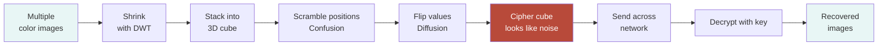
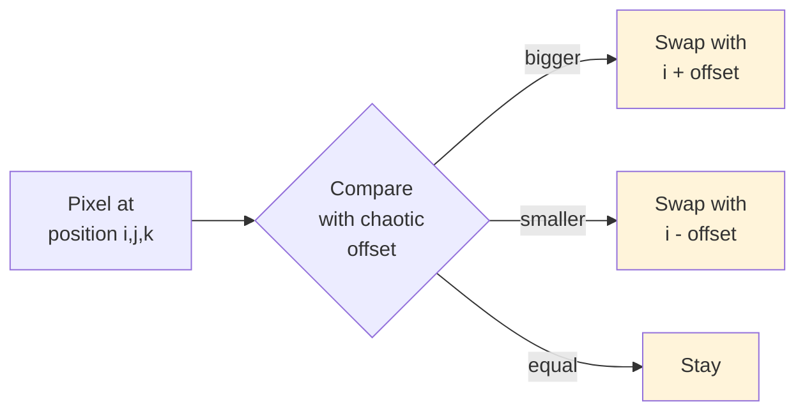
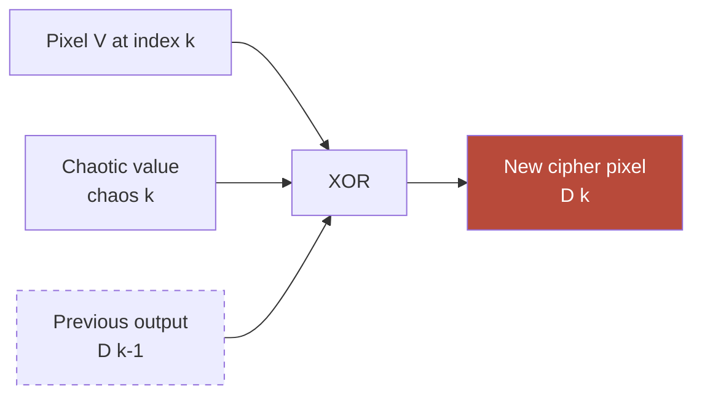
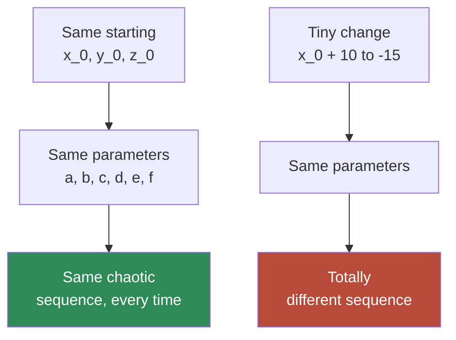
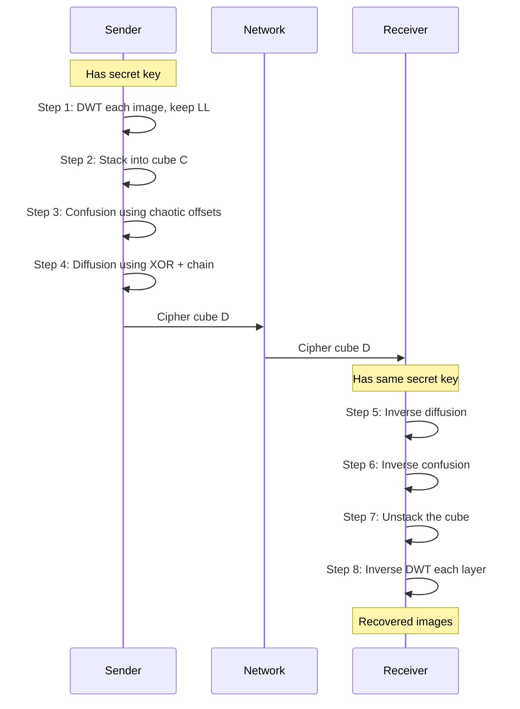
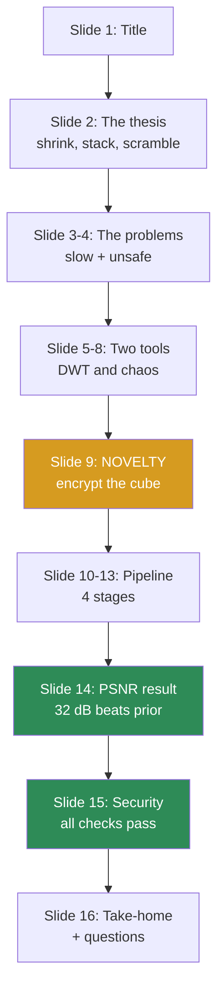

# Visual Cheat Sheet

> **Every concept as a diagram.**
> Glance at this when you're lost during studying.
> All diagrams render in Obsidian, GitHub, and any modern markdown viewer.

---

## The whole paper, in one diagram



**Three magic words:** SHRINK → STACK → SCRAMBLE.

---

## DWT — splits an image into 4 sub-bands

A single image goes in. Four smaller pieces come out:

```
┌──────────────┬──────────────┐
│              │              │
│      LL      │      LH      │
│  blurry      │  horizontal  │
│  version     │  edges       │
│   (KEEP)     │   (TOSS)     │
│              │              │
├──────────────┼──────────────┤
│              │              │
│      HL      │      HH      │
│  vertical    │  diagonal    │
│  edges       │  edges       │
│   (TOSS)     │   (TOSS)     │
│              │              │
└──────────────┴──────────────┘
```

**Keep LL. Toss the other three. Image is now 1/4 the size.**

---

## DWT — what each sub-band actually looks like

If you visualize each sub-band on a photo of a face:

| Sub-band | Looks like |
|---|---|
| **LL** | A blurry, half-sized version of the face — clearly recognizable |
| LH | Mostly black with bright streaks where horizontal edges are (eyebrows, mouth, hairline) |
| HL | Mostly black with bright streaks on vertical edges (nose, sides of face) |
| HH | Mostly black with sparse spots on diagonal edges + noise |

```
   ORIGINAL              LL                  LH/HL/HH
   ╭─────╮             ╭───╮              ╭───╮
   │ 😊  │   ─DWT─►    │ 😊 │             │ ⫶⫶ │
   │     │             ╰───╯              ╰───╯
   ╰─────╯           (keep this)         (throw away)
   128×128            64×64               64×64
   18 KB              4.5 KB              wasted bits
```

---

## The cube — stacking shrunken images

You have several shrunken images. Stack them like cards in a deck:

```
        ┌─────────────────────────┐
       /                          /│
      /         Image N           / │
     /                          /   │
    ┌─────────────────────────┐    │
    │                         │   ←┤   each "card" =
    │       Image 2           │    │   one image's
    │                         │  / │   LL (shrunken)
    ├─────────────────────────┤ /  │
    │                         │/   │
    │       Image 1           │    │
    │                         │   /
    └─────────────────────────┘  /
            M_w (width)         /
                          M_h (height)
                          z = depth = N
```

- **Width × Height** = size of the LARGEST image (others get padded with zeros)
- **Depth** = number of images in the batch

This is the **plaintext cube C**.

---

## Confusion — scramble pixel positions

Before:
```
A B C D
E F G H        ← Each letter = a pixel value at a specific position
I J K L
M N O P
```

After applying confusion (positions scrambled via chaotic offsets):
```
K I D B
N A F M        ← Same 16 pixel VALUES, but rearranged
J O P L
G H C E
```

**Pixel values UNCHANGED. Only POSITIONS moved.**



---

## Diffusion — flip pixel VALUES with XOR chain



**The dashed arrow is the chain.** Each cipher pixel depends on the previous one. A one-bit change at the start cascades through every later pixel.

### What XOR does (truth table)

```
A   B   A XOR B
0   0       0
0   1       1
1   0       1
1   1       0
```

XOR returns 1 when the inputs are different. **Key property: A XOR B XOR B = A.** Apply XOR twice with the same key, and you get back the original.

### The chain visualised

```
V[0]                 V[1]            V[2]            V[3]
 │                    │               │               │
 │  chaos[0]          │ chaos[1]      │ chaos[2]      │ chaos[3]
 ▼  ▼                 ▼  ▼            ▼  ▼            ▼  ▼
 XOR  ──►─ D[0] ──►── XOR ──►─ D[1] ─►─XOR ──►─ D[2] ─►─XOR ──► D[3]
                       │               │               │
                       └───────────────┴───────────────┘
                          (each output feeds the next)
```

Flip one bit of `V[0]` → `D[0]` changes → `D[1]` changes → `D[2]` changes → ... avalanche.

---

## Chaotic map — random-looking but reproducible

Starting state `(x₀, y₀, z₀) = (0.1, 0.1, 0.1)`:

```
step  x         y         z       (kind of)
─────────────────────────────────────────
  0   0.1000    0.1000    0.1000
  1   0.997     0.290     -0.080
  2   0.701    -0.832      0.654
  3  -0.512     0.193     -0.291
  4   0.844     0.602      0.117
  5  -0.276    -0.418     -0.733
  ...           ...        ...
```

**Looks random, but:**



**Determinism + extreme sensitivity = ideal encryption key**

---

## Full pipeline (encryption + decryption)



---

## Security scorecard at a glance

```
┌─────────────────────────────────────────────────────────────┐
│                    SECURITY SCORECARD                       │
├─────────────────────────────────────────────────────────────┤
│  Test                  Ideal      Paper        Status       │
├─────────────────────────────────────────────────────────────┤
│  Entropy              8.0000     7.9994       ✓ PASS        │
│  NPCR (%)             99.6094    99.6533      ✓ PASS        │
│  UACI (%)             33.4635    33.4887      ✓ PASS        │
│  NIST randomness      15/15      15/15        ✓ PASS        │
│  Key space            ≥ 2¹⁰⁰     ≥ 2¹⁰⁰       ✓ PASS        │
│  PSNR (dB)            > 30       32.06        ✓ PASS        │
│  Shear (15% cut)      —          ~30 dB       ✓ PASS        │
│  Noise injection      —          recoverable  ✓ PASS        │
└─────────────────────────────────────────────────────────────┘
```

Six tests, all passing. That's the paper's defense.

---

## PSNR — what it means visually

```
                 PSNR scale (dB)
   ┌────────────────────────────────────────────────────────┐
   │                                                        │
   0      10       20       30   ★    40       50      ∞
   │      │        │        │        │        │           │
   │      │        │        │        │        │           │
trash   bad   recognizable  good  visually   perfect      │
                                identical                 │
                                                          │
       Prior work             THIS PAPER                  │
       (26-27 dB)             (32.06 dB)                  │
            ▼                       ▼                     │
            ⬆                       ⬆                     │
   ┌────────────────────────────────────────────────────────┘
       BELOW threshold       ABOVE threshold
       (artifacts visible)   (looks identical)
```

**30 dB is the magic line.** This paper sits comfortably above it. Prior work doesn't.

---

## The novelty in one image

```
   THE OLD WAY                          THE NEW WAY (THIS PAPER)
   ───────────────                      ─────────────────────────

   Image 1 ──► compress ──► encrypt    Image 1 ──┐
   Image 2 ──► compress ──► encrypt    Image 2 ──┤
   Image 3 ──► compress ──► encrypt    Image 3 ──┤
   ...                                 ...        │
                                                  ▼
   (N images = 2N steps)              ┌──── compress all ────┐
                                      │                       │
                                      │     stack into        │
                                      │     ONE 3D cube       │
                                      │                       │
                                      └──── encrypt ONCE ────┘
                                              ▼
                                       1 cube, 1 encryption
                                       (regardless of N images)
```

**One pass, multiple images, regardless of size.**

---

## Quick mental flow for the talk



---

## Memory anchor cheat strip

If you can only remember 6 things, memorize these one-liners:

| Anchor | What it pins |
|---|---|
| **Shrink, Stack, Scramble** | The whole paper |
| **Keep LL, toss the others** | What DWT does in this paper |
| **Same key, same chaos. Different key, different chaos.** | What a chaotic map is |
| **Confusion moves. Diffusion changes.** | The two encryption operations |
| **Each output glued to the previous** | The chain that gives avalanche |
| **32 dB beats 27 dB** | The headline result |

Read these 6 lines out loud right before walking into the talk.

---

## "When in doubt, point at the cube"

If you blank during the talk, point at any slide showing the cube (slides 9, 10, or 11) and say:

> *"The key idea is this — we take multiple images, shrink them, stack them into this 3D cube, and encrypt the whole cube as one object. That's what's new. Everything else is implementation details."*

That recovery line uses the visual on screen and rebuilds the audience's understanding in 10 seconds.
